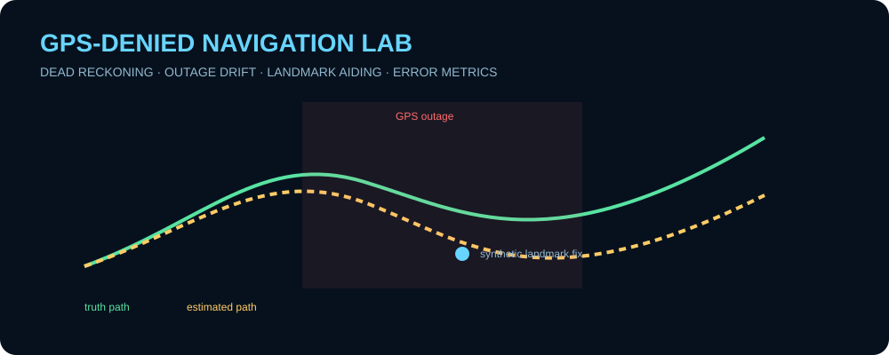
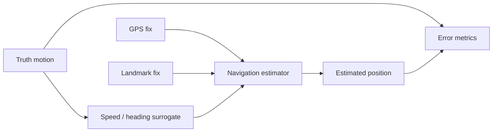

# GPS-Denied Navigation Lab

  

A runnable synthetic navigation-resilience experiment showing how **dead reckoning accumulates error during a GPS outage** and how occasional generic landmark fixes can bound that drift. The project exposes truth, measurements, estimates, and error metrics so the behavior is inspectable rather than hidden behind a black box.

> All motion, noise, outage timing, and landmark geometry are arbitrary and synthetic. This project demonstrates navigation software design, not operational navigation for a real platform.

<p align="center"></p>

## Features

- 2-D truth trajectory generator
- noisy speed and heading measurements
- inertial/dead-reckoning style position propagation
- configurable GPS availability window
- periodic synthetic landmark corrections during GPS denial
- deterministic random seeds
- position-error time histories
- peak, mean, outage-end, and recovery error metrics
- CSV output, tests, and GitHub Actions CI

## Architecture



## Quick start

```bash
git clone https://github.com/skytruong90/GPS-Denied-Navigation-Lab.git
cd GPS-Denied-Navigation-Lab
python navigation.py --duration 60 --gps-outage-start 15 --gps-outage-end 45 --output artifacts
```

Run automated verification:

```bash
python -m unittest discover -s tests -v
```

## Experiment

The nominal scenario begins with GPS updates available. During the configured outage, the navigation estimate propagates using noisy speed and heading only, so error grows over time. Generic synthetic landmark observations arrive less frequently and pull the estimate back toward the truth state. GPS recovery then demonstrates how quickly absolute position error collapses.

## Outputs

The CSV trace records truth position, estimated position, GPS availability, landmark-aiding events, and position error at each step. Summary data capture maximum error, mean error, error at outage end, and post-recovery performance.

## Validation strategy

Tests check deterministic seeding, drift growth when absolute aiding is unavailable, error reduction after a correction, configurable outage timing, and successful artifact creation. CI runs the suite and a short smoke scenario.

## What I learned / demonstrated

- why dead reckoning can remain locally smooth while absolute position error grows
- how intermittent absolute measurements can bound long-duration drift
- why truth, measurement, and estimate states should remain separate in a navigation simulation
- how outage-end and recovery metrics communicate resilience better than one final error number
- how deterministic random seeds make navigation experiments repeatable in CI

## Limitations

This is a planar software demonstration rather than a full inertial-navigation system. It omits accelerometer/gyro mechanization, Earth-rate effects, covariance propagation, coordinate frames, map matching, terrain sensing, real GPS observables, and validated sensor specifications.

## Public-data disclaimer

All inputs and geometry are synthetic and public-safe.