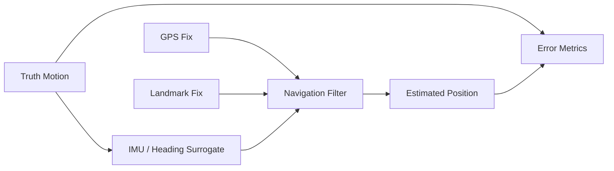

# GPS-Denied Navigation Lab

A synthetic navigation resilience experiment that demonstrates how inertial dead reckoning drifts during a GPS outage and how occasional generic landmark fixes can bound position error.

## Features

- 2D truth trajectory generator
- Noisy speed/heading dead reckoning
- Configurable GPS availability window
- Periodic landmark corrections during denied navigation
- Position-error statistics and outage recovery metrics
- Deterministic random seeds, CSV output, tests, and CI



## Run

```bash
python navigation.py --duration 60 --gps-outage-start 15 --gps-outage-end 45 --output artifacts
python -m unittest discover -s tests -v
```

## Public-data disclaimer

This project uses arbitrary synthetic motion and landmark geometry. It is intended to demonstrate navigation software design, not operational navigation techniques for a real platform.